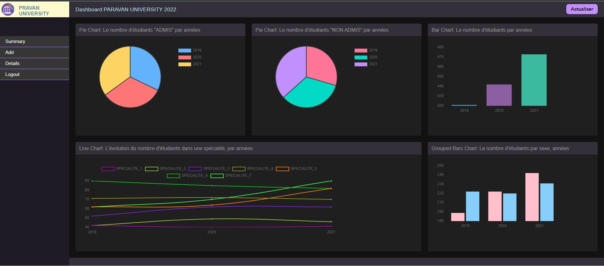

# University's Dashboard
PROGRAMMATION AVANCEE PROJECT

* A simple dashboard that helps the university 'PRAVAN' to present its data using a dynamic web page in order to allow the various decision-makers
to visualize the data.

* It provides five (05) graphes:
  1. PIE CHART: The number of the admitted students per years.
  2. PIE CHART: The number of the not admitted students per years.
  3. BAR CHART: The total number of students per years.
  4. LINE CHART: The evolution of the number of students of each speciality per years.
  5. GROUPED BAR CHART: The number of students per sex and years.

* Technologies:
  - HTML & CSS
  - JavaScript
  - Python (The framework fLASK)
  - Ajax technique.
  - Relational databese using (SQL)

* The interface contains:
  - A side bar that contains a menu on the left.
  - A header and a footer.
  - The logo of the university on the upper left.
  - A refresh button on the upper right.
  - A main space that contains the five charts.

